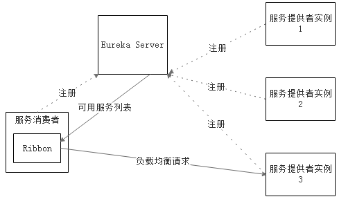

## Ribbon负载均衡

- 简介
    - Ribbon是Netflix发布的云中间层服务开源项目，其主要功能是提供客户端侧负载均衡算法。Ribbon客户端组件提供一系列完善的配置项如连接超时，重试等。简单的说，Ribbon是一个客户端负载均衡器，我们可以在配置文件中列出Load Balancer后面所有的机器，Ribbon会自动基于某种规则（如简单轮询，随机连接等）去连接这些机器，我们也很容易使用Ribbon实现自定义的负载均衡算法。
    - Eureka与Ribbon连用

        

        - Ribbon工作时分为两步：第一步先选择 Eureka Server, 它优先选择在同一个Zone且负载较少的Server；第二步再根据用户指定的策略，在从Server取到的服务注册列表中选择一个地址。其中Ribbon提供了多种策略，例如轮询round robin、随机Random、根据响应时间加权等
- 基本使用
    - 引入依赖：group：`org.springframework.cloud`，artifact id：`spring-cloud-starter-ribbon`
        - 如果引入了`spring-cloud-starter-eureka`中默认引入了，此时可无需再引入
    - 在restTemplate对应的Bean上注解`@LoadBalanced`

        ```java
    	@Bean
    	@LoadBalanced // 使用ribbon实现客户端负载均衡
    	public RestTemplate restTemplate() {
    		return new RestTemplate();
    	}
        ```
    - 备注：此时需要启动多个服务提供者进行测试，IDEA中：
        - 可以先启动一个后再将端口改掉再启动另外一个
        - (推荐) `Eidt Configurations`再配置一个Spring boot的启动项，配置时将`Spring Boot Settings` - `Override parameters`添加一个参数`server.port=8080`
- 自定义负载均衡策略

    ```yml
    # robbin负载均衡策略优先级：配置文件策略 > 代码级别策略 > ribbon默认策略(com.netflix.loadbalancer.ZoneAvoidanceRule)
    provider-user:
      ribbon:
          # 当访问服务provider-user时采用随机策略RandomRule，此时访问其他服务时仍然为默认策略ZoneAvoidanceRule；WeightedResponseTimeRule响应时间加权策略
          NFLoadBalancerRuleClassName: com.netflix.loadbalancer.RandomRule
    ```
- 脱离Eureka的配置，此时仍然可以运行Eureka，但是不从eureka中获取服务地址，而是从配置文件中读取

    ```yml
    stores:
      ribbon:
        listOfServers: example.com,aezo.cn
    ```