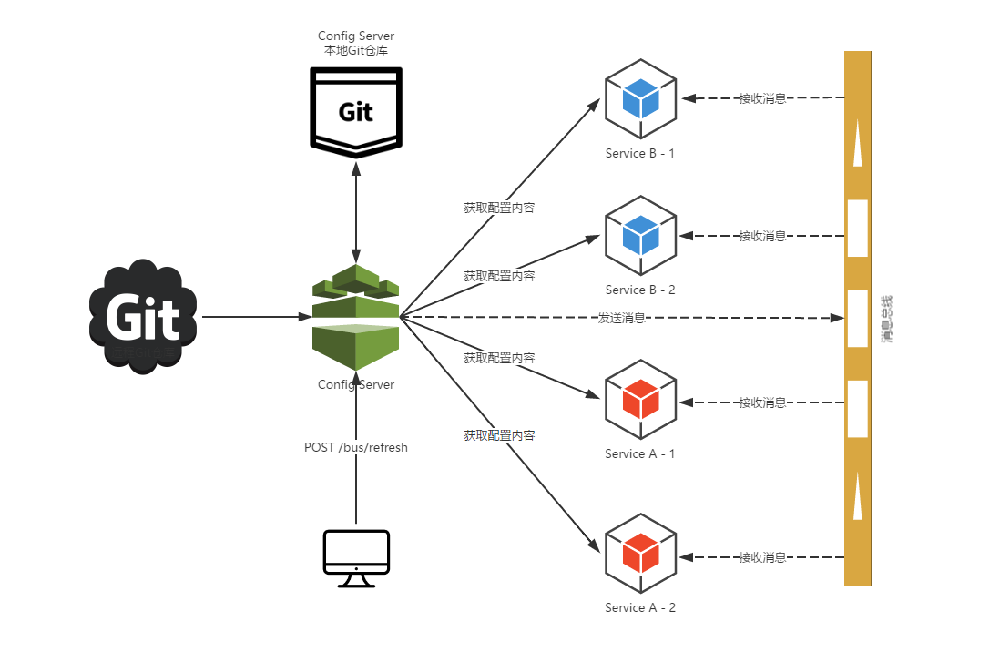

## Bus 消息总线(Spring Cloud Bus)

> 消息总线以config-server和consumer-movie-ribbon为例. 基于rabbitmq或者kafka只需要修改相关依赖即可

- 简介：使用轻量级的消息代理来构建一个公用的消息主题让系统中所有微服务都连接上来，由于该主题会被所有实例监听和消费所以称消息总线。各个实例都可以广播消息让其他实例消费。
- 是基于消息队列(如：ActiveMQ/Kafka/RabbitMQ/RocketMQ), Spring Cloud Bus暂时支持RabbitMQ和Kafka

### 以RabbitMQ为例

> RabbitMQ是实现了高级消息队列协议(AMQP)的开源消息代理软件，也称为面向消息的中间件。后续操作需要先安装RabbitMQ服务。关于RabbitMQ在SpringBoot中的使用参考SpringBoot章节

- 在`config-server`和`consumer-movie-ribbon`两个服务中加入bus依赖

    ```xml
    <!-- 消息总线 -->
	<dependency>
		<groupId>org.springframework.cloud</groupId>
		<artifactId>spring-cloud-starter-bus-amqp</artifactId>
	</dependency>
    ```
- 启动RabbitMQ服务(如果未修改默认配置，则SpringBoot会自动连接。自定义配置如下)

    ```yml
    # 这是springboot的默认配置，可根据实际情况修改
    spring:
      rabbitmq:
        host: localhost
        port: 5672
        username: guest
        password: guest
    ```
- 启动一个`config-server`和两个`consumer-movie-ribbon`(9000、9002)
- 修改上述【分布式配置中心】的git管理的配置字段`from`
- 刷新`config-server`：`POST`访问http://localhost:7000/bus/refresh
    - `POST`访问http://localhost:7000/refresh 只能刷新`config-server`本身
    - `POST`访问http://localhost:7000/bus/refresh 可以刷新消息总线上所有的服务
    - `POST`访问http://localhost:7000/bus/refresh?destination=consumer-movie-ribbon:9000 可以刷新的指定服务实例
    - `POST`访问http://localhost:7000/bus/refresh?destination=consumer-movie-ribbon:** 可以刷新服务consumer-movie-ribbon下的所有实例
    - 刷新消息总线上的任何一个服务都可以到达此效果(消息总线上的其他服务会收到触发刷新服务的消息，进行同步刷新)
- 原理如下 [^3]

    

### 以Kafka为例

> Kafka是有LinkedIn开发的分布式消息系统，现由Apache维护，使用Scala实现。

- 更换依赖

    ```xml
    <dependency>
		<groupId>org.springframework.cloud</groupId>
		<artifactId>spring-cloud-starter-bus-kafka</artifactId>
	</dependency>
    ```
- 只需更换依赖，其他地方同rabbitmq即可(使用kafka默认配置时会产生一个Topic为)
- 启动kafka(包括zookeeper). 关于`Kafka`使用可查看文章【Kafka】
- 启动应用后会产生一个名为springCloudBus的Topic

